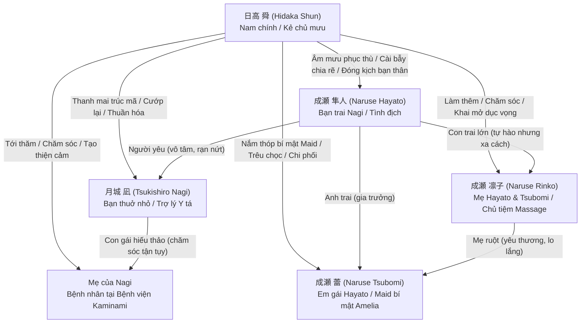
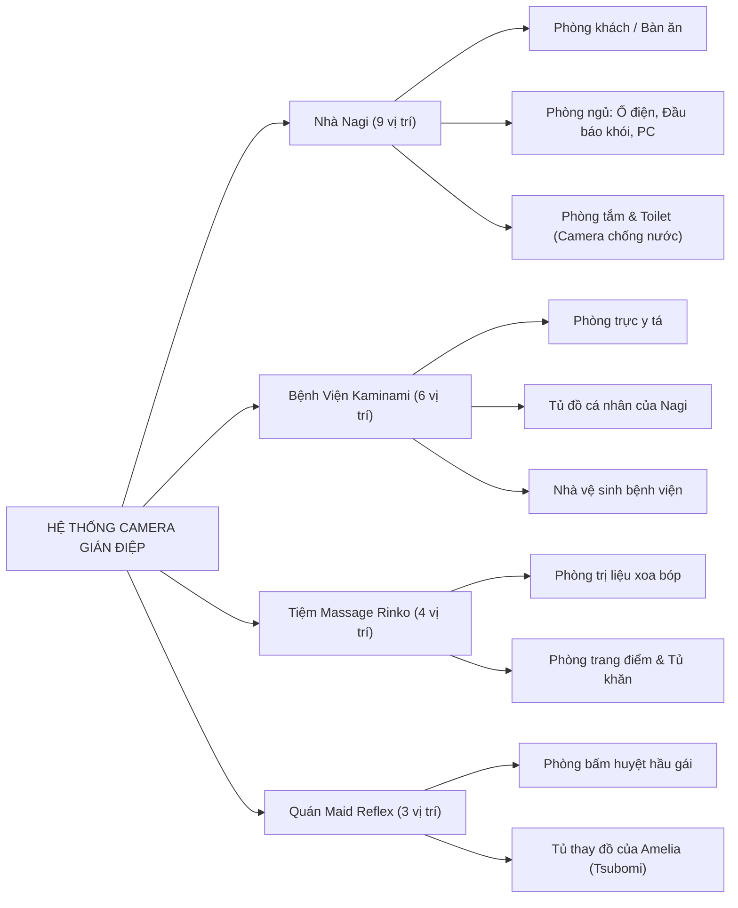
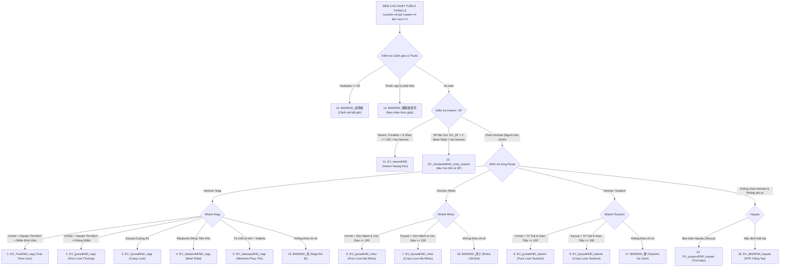

# TÀI LIỆU NGHIÊN CỨU & BÁCH KHOA TOÀN THƯ GAME: HOME (ROOM)
### Mã số DLsite: RJ01556529 | Nhà phát triển: SORAREVO | Engine: TyranoScript / Electron
### Phạm vi nghiên cứu: 100% Nội dung kịch bản (148 Files, 48.154 dòng code, 11.827 dòng thoại, 517 biến số, 362 nhánh lựa chọn, 1.249 CGs/Animation, 18 Endings)

---

## MỤC LỤC CHI TIẾT
1. [TỔNG QUAN DỰ ÁN & TIỀN ĐỀ CỐT TRUYỆN](#1-tổng-quan-dự-án--tiền-đề-cốt-truyện)
2. [HỒ SƠ NHÂN VẬT & MẠNG LƯỚI QUAN HỆ TOÀN CẢNH](#2-hồ-sơ-nhân-vật--mạng-lưới-quan-hệ-toàn-cảnh)
3. [VÒNG LẶP THỜI GIAN 3 THÁNG & CƠ CHẾ HOẠT ĐỘNG NGÀY / ĐÊM](#3-vòng-lặp-thời-gian-3-tháng--cơ-chế-hoạt-động-ngày--đêm)
4. [HỆ THỐNG 8 CHỈ SỐ NHÂN VẬT & CÔNG THỨC RÈN LUYỆN](#4-hệ-thống-8-chỉ-số-nhân-vật--công-thức-rèn-luyện)
5. [HỆ THỐNG ĐÁNH GIÁ GIAO TIẾP 4 TRỤC (COMMU 2D GRID) & 13 DANH HIỆU](#5-hệ-thống-đánh-giá-giao-tiếp-4-trục-commu-2d-grid--13-danh-hiệu)
6. [HỆ THỐNG GIÁN ĐIỆP, XÂM NHẬP, ĐẶT CAMERA & GÀI BẪY CHIA RẼ](#6-hệ-thống-gián-điệp-xâm-nhập-đặt-camera--gài-bẫy-chia-rẽ)
7. [HỆ THỐNG GIAO TIẾP HẰNG NGÀY, HẸN HÒ & TẶNG QUÀ](#7-hệ-thống-giao-tiếp-hằng-ngày-hẹn-hò--tặng-quà)
8. [HƯỚNG DẪN CHI TIẾT TOÀN BỘ 18 KẾT THÚC (18 ENDINGS GUIDE)](#8-hướng-dẫn-chi-tiết-toàn-bộ-18-kết-thúc-18-endings-guide)
9. [HỆ THỐNG H-SCENE, KHAI MỞ THÂN THỂ (KAIHATSU) & ĐỒ CHƠI TÌNH DỤC](#9-hệ-thống-h-scene-khai-mở-thân-thể-kaihatsu--đồ-chơi-tình-dục)
10. [BẢNG DANH MỤC VẬT PHẨM, GIÁ CẢ & KINH TẾ GAME](#10-bảng-danh-mục-vật-phẩm-giá-cả--kinh-tế-game)
11. [KIẾN TRÚC KỸ THUẬT, ASAR, HỆ THỐNG 517 BIẾN SỐ & SAVE DATA](#11-kiến-trúc-kỹ-thuật-asar-hệ-thống-517-biến-số--save-data)
12. [QUY CHUẨN VIỆT HÓA CHUYÊN SÂU & HƯỚNG DẪN KỸ THUẬT](#12-quy-chuẩn-việt-hóa-chuyên-sâu--hướng-dẫn-kỹ-thuật)

---

## 1. TỔNG QUAN DỰ ÁN & TIỀN ĐỀ CỐT TRUYỆN

### 1.1 Thông Tin Kỹ Thuật Dự Án
- **Tên phát hành:** HOME (Tên thư mục nội bộ / Save data: ROOM)
- **Circle phát triển:** SORAREVO (Website: `http://sorarevo.net/`, Twitter: `@SORAREVO`)
- **Kịch bản:** Sakura Kogitsune (@konkonsakurakon)
- **Mã định danh DLsite:** RJ01556529
- **Phiên bản:** Full Release (Bản đầy đủ)
- **Dung lượng tập tin:** 8.62 GB (Gói nén Electron ASAR chứa hơn 1.200 ảnh Animation GIF/PNG và âm thanh chất lượng cao)
- **Diễn viên lồng tiếng (Voice Cast):**
  - **月城 凪 (Tsukishiro Nagi):** CV. 椿りむ (Tsubaki Rimu)
  - **成瀬 凛子 (Naruse Rinko):** CV. 天音みづち (Amane Mizuchi)
  - **成瀬 蕾 (Naruse Tsubomi):** CV. 聖羅あかね (Seira Akane)

### 1.2 Tiền Đề Cốt Truyện Toàn Cảnh
- **Mùa hè định mệnh:** Câu chuyện bắt đầu vào đầu tháng 6 và khép lại vào cuối tháng 8 tại thị trấn ven biển Kaminami (上浪).
- **Sự trở về của Nam chính:** **日高 舜 (Hidaka Shun)** sau 10 năm xa cách đã chuyển về sống một mình trong căn phòng trọ thuộc khu chung cư tập thể cũ (団地). Nơi đây lưu giữ vô số ký ức tuổi thơ tươi đẹp giữa anh và cô bạn thanh mai trúc mã **月城 凪 (Tsukishiro Nagi)**.
- **Bi kịch hội ngộ:** Ngay khi gặp lại Nagi, Shun bàng hoàng nhận ra cô hiện đã là bạn gái của **成瀬 隼人 (Naruse Hayato)** – một thanh niên bảnh bao, tự phụ, làm ra nhiều tiền và luôn tỏ thái độ kẻ cả với Shun. Hayato không hề biết quá khứ giữa Nagi và Shun, thậm chí còn hào phóng giới thiệu Shun vào làm thêm tại tiệm massage thư giãn của mẹ ruột mình là **成瀬 凛子 (Naruse Rinko)**.
- **Kế hoạch phục thù & chiếm đoạt trong 3 tháng hè:**
  - Lòng tự ái bị chà đạp và nỗi uất ức mất đi người con gái mình yêu thương đã biến Shun thành một kẻ mưu mô.
  - Shun vạch ra kế hoạch trong 90 ngày mùa hè:
    1. Rèn luyện 6 chỉ số bản thân (Thể lực, Trí tuệ, Giao tiếp, Chu đáo, Sức mạnh, Dũng khí).
    2. Thâm nhập vào mọi ngóc ngách đời sống của đối phương (nhà Nagi, tiệm massage của mẹ Rinko, bệnh viện nơi Nagi làm việc, quán Maid Reflex nơi em gái Tsubomi làm thêm).
    3. Đặt hệ thống camera gián điệp, cài bẫy ghen tuông chia rẽ Nagi và Hayato.
    4. Chiếm đoạt và thuần phục toàn bộ những người phụ nữ xung quanh kẻ thù: từ bạn gái Nagi, mẹ Rinko cho đến em gái Tsubomi.

---

## 2. HỒ SƠ NHÂN VẬT & MẠNG LƯỚI QUAN HỆ TOÀN CẢNH



### 2.1 日高 舜 (Hidaka Shun) — Nam Chính (Protagonist)
- **Tên mặc định:** 日高 舜 (Họ: 日高 - Hidaka, Tên: 舜 - Shun).
- **Tâm lý & Tính cách:** Có sự biến chuyển linh hoạt theo hành vi của người chơi:
  - *Nhánh Thuần Ái (Pure Love):* Một chàng trai nỗ lực vượt qua mặc cảm thất bại, rèn luyện bản thân, chân thành yêu thương và bảo vệ Nagi khỏi sự vô tâm của Hayato.
  - *Nhánh Chi Phối / Nô Lệ (Dominance / Meat Toilet):* Một kẻ biến thái, tính toán lạnh lùng, sử dụng camera quay lén, thuốc kích dục và bẫy tâm lý để hạ nhục và biến các cô gái thành công cụ tình dục.
  - *Nhánh Harem:* Bậc thầy quản lý thời gian và cảm xúc, chinh phục trọn vẹn cả 3 người phụ nữ mà không để xảy ra đổ vỡ.

### 2.2 月城 凪 (Tsukishiro Nagi) — CV: 椿りむ (Tsubaki Rimu)
- **Nghề nghiệp:** Trợ lý điều dưỡng (看護助手) tại Bệnh viện Đa khoa Kaminami (上浪総合病院).
- **Hoàn cảnh:** Mẹ ruột đang nằm điều trị dài ngày tại bệnh viện. Đang sống tại căn hộ chung cư gia đình.
- **Mối quan hệ với Hayato:** Hayato bận rộn với công việc và dần trở nên thờ ơ, gia trưởng, khiến Nagi luôn cảm thấy cô đơn và thiếu thốn sự quan tâm thấu hiểu.
- **Tâm lý với Shun:** Shun là "siêu anh hùng" (スーパーヒーロー) trong ký ức tuổi thơ. Khi Shun xuất hiện và chia sẻ gánh nặng chăm sóc mẹ, Nagi rơi vào trạng thái dằn vặt tội lỗi dữ dội trước khi hoàn toàn ngả vào vòng tay Shun.

### 2.3 成瀬 凛子 (Naruse Rinko) — CV: 天音みづち (Amane Mizuchi)
- **Nghề nghiệp:** Chủ tiệm kiêm kỹ thuật viên chính tại Tiệm Massage Thư Giãn Naruse (リラクゼーションサロン).
- **Gia cảnh:** Mẹ đơn thân của Naruse Hayato (con trai lớn) và Naruse Tsubomi (con gái nhỏ).
- **Đặc điểm tâm lý:** Phụ nữ U40 mặn mà, đằm thắm, vẻ ngoài nghiêm túc đoan trang nhưng bên trong thiếu vắng hơi ấm đàn ông đã nhiều năm. Kỹ thuật massage và sự nam tính của Shun đã đánh thức bản năng nhục dục nguyên thủy của Rinko.

### 2.4 成瀬 蕾 (Naruse Tsubomi) — CV: 聖羅あかね (Seira Akane)
- **Thân phận:** Con gái út của Rinko, em gái của Hayato.
- **Bí mật đen tối:** Lén gia đình đi làm thêm nhân viên tẩm quất/bấm huyệt hầu gái tại quán Maid Reflexology với nghệ danh **"Amelia" (アメリア)** để kiếm tiền tiêu xài và khẳng định bản thân.
- **Tâm lý:** Bên ngoài tỏ ra đanh đá, bất cần và cảnh giác cao độ; nhưng bên trong lại cực kỳ ngây thơ, sợ bị mẹ mắng và sợ anh trai coi thường. Bị Shun nắm thóp bí mật nên từ chỗ sợ hãi chống cự đã dần chuyển sang phụ thuộc và tôn sùng Shun.

### 2.5 成瀬 隼人 (Naruse Hayato) — Tình Địch Tự Mãn
- **Đặc điểm:** Con trai cả của Rinko, bạn trai hiện tại của Nagi. Tự phụ vào công việc và thu nhập, xem Nagi như sở hữu riêng và xem Shun như một kẻ thất nghiệp đáng thương hại.
- **Vai trò trong cốt truyện:** Là nguồn cơn cho sự hận thù của Shun. Các hành động gài bẫy của Shun sẽ dần khiến Hayato nghi ngờ Nagi ngoại tình, nổi giận vô cớ và tự tay phá hủy mối quan hệ với Nagi.

---

## 3. VÒNG LẶP THỜI GIAN 3 THÁNG & CƠ CHẾ HOẠT ĐỘNG NGÀY / ĐÊM

Game kéo dài đúng **12 tuần (Tháng 6, 7, 8 - 4 tuần/tháng)**. Mỗi ngày trôi qua với các giai đoạn cụ thể:

### 3.1 Buổi Sáng (Morning Phase: Thứ 2 $\rightarrow$ Thứ 7)
Người chơi chọn 1 hành động duy nhất để sử dụng thời gian buổi sáng:
1. **Nghỉ ngơi / Ngủ (寝る):**
   - Hồi phục Thể lực (`f.para_taityou += 20`).
   - Giảm Căng thẳng (`f.para_sutoresu -= 20`).
2. **Làm thêm tại Tiệm Massage (マッサージ店バイト):**
   - Tăng Giao tiếp (`f.para_komyu += 2`) và Chu đáo (`f.para_kikubari += 2`).
   - Nhận lương: ~3.000 $\rightarrow$ 6.000 Yên (tùy chỉ số Hưng phấn Tension).
   - Tăng thiện cảm với Rinko (`f.koukando_rinko += 0.5`).
3. **Lao công Bệnh viện Kaminami (病院清掃):**
   - Tăng Chu đáo (`f.para_kikubari += 2`) và Sức mạnh (`f.para_kinryoku += 2`).
   - Nhận lương ~3.000 $\rightarrow$ 6.000 Yên.
   - Tăng thiện cảm với Nagi (`f.koukando_nagi += 0.5`).
4. **Làm văn phòng Maid Reflex (リフレ事務):**
   - Tăng Trí tuệ (`f.para_kasikosa += 2`) và Giao tiếp (`f.para_komyu += 2`).
   - Nhận lương ~3.000 $\rightarrow$ 6.000 Yên.
   - Tăng thiện cảm với Tsubomi (`f.koukando_tubomi += 0.5`).
5. **Giao dịch Ngoại hối FX (FX取引):**
   - Tăng Dũng khí (`f.para_yuuki += 2`) và Trí tuệ (`f.para_kasikosa += 2`).
   - Kết quả ngẫu nhiên: Lãi lớn (+20.000 $\rightarrow$ +50.000 Yên) hoặc Thua lỗ (-10.000 $\rightarrow$ -30.000 Yên). Không phụ thuộc Tension.
6. **Tập thể hình tại nhà (筋トレ):**
   - Tăng Sức mạnh (`f.para_kinryoku += 3`) và Dũng khí (`f.para_yuuki += 2`).
   - Tiêu tốn Thể lực (`f.para_taityou -= 15`), tăng Căng thẳng.
7. **Đột nhập gián điệp (侵入):**
   - Đột nhập vào 1 trong 4 địa điểm để đặt camera hoặc lục lọi đồ đạc.

### 3.2 Buổi Chiều Tối (Evening Phase: Thứ 2 $\rightarrow$ Thứ 7)
Người chơi có thể di chuyển ra ngoài thị trấn Kaminami:
- **Bệnh viện Kaminami (病院):** Khám bệnh/Hồi sức (+30 Thể lực, tốn 5.000 Yên). Gặp Nagi hoặc Hayato.
- **Tiệm Massage Thư Giãn (リラクゼーション):** Trị liệu xoa bóp (-20 Stress, tốn 5.000 Yên). Tương tác với Rinko.
- **Quán Maid Reflex (メイドリフレ):** Dịch vụ bấm huyệt của Amelia (+Dũng khí, tốn 5.000 Yên). Tương tác với Tsubomi.
- **Nhà hàng Gia đình (ファミレス):**
  - Làm thêm ca đêm: +4.000 Yên, tiêu hao Thể lực.
  - Ăn tối: Mua các món ăn giúp hồi phục và tăng chỉ số tương ứng.
- **Phố Sầm Uất (繁華街):**
  - Mua vé số (Xổ số công bố giải thưởng vào đêm Chủ Nhật hàng tuần).
  - Tập Gym chuyên nghiệp (+Sức mạnh, tốn 5.000 Yên).
- **Trung Tâm Thương Mại (ショッピングモール):** Mua sắm máy móc gián điệp, dược phẩm 18+, quà tặng, sách kỹ năng, nhẫn cầu hôn.

### 3.3 Buổi Đêm (Night Phase)
- **Xem hình ảnh/video quay lén qua PC (盗撮確認):** Xem các đoạn cắt cảnh nhạy cảm thu được từ hệ thống camera.
- **Hệ Thống Đánh Giá Giao Tiếp (コミュ評価):** Điều chỉnh điểm số thiện cảm và mức độ thống trị trên lưới 2D.
- **Xem Hồ Sơ Nhân Vật (Profile):** Kiểm tra tiến độ mở khóa điều kiện Ending và chọn **Honmei (本命 - Người yêu chính)**.
- **Kích hoạt sự kiện phòng ngủ 18+:** Mời nhân vật đến phòng, chuốc thuốc kích dục, chuốc rượu Spirytus hoặc thuốc ngủ.
- **Lưu dữ liệu game (Save Game).**

### 3.4 Ngày Chủ Nhật (Sunday Routine)
- **Sự kiện Hẹn Hò (Dating Events):** Nếu đã hẹn trước vào thứ Bảy, Chủ Nhật sẽ diễn ra sự kiện hẹn hò cả ngày với Nagi, Rinko, Tsubomi hoặc Hayato.
- **Công bố kết quả Xổ số:** Nếu có mua vé số ở phố sầm uất, kết quả trúng thưởng sẽ được cộng tiền vào đêm Chủ Nhật.
- **Chuẩn bị tuần mới:** Hồi phục một phần thể lực và giảm căng thẳng.

---

## 4. HỆ THỐNG 8 CHỈ SỐ NHÂN VẬT & CÔNG THỨC RÈN LUYỆN

```
Chỉ số hiển thị = Math.floor(Chỉ số nội tại / 10)
```

| Tên Chỉ Số | Tên Tiếng Việt Chuẩn | Biến Nội Tại | Biến Hiển Thị | Yêu Cầu Kết Thúc & Tác Động Tâm Lý Nhân Vật |
|---|---|---|---|---|
| **体力** | **Thể Lực / Sức Bền** | `f.para_taityou` | `f.para_taityou_display` | Harem End: $\ge 120$. Năng lượng hành động trong ngày; khi thể lực cạn kiệt, Shun thở dốc, bước đi lảo đảo mệt nhoài. |
| **ストレス** | **Căng Thẳng / Mức Độ Stress** | `f.para_sutoresu` | `f.para_sutoresu_display` | Cần giữ $< 80$ tránh ngất xỉu. Khi stress cao: Shun dễ cáu bẳn, nhức đầu, suy nghĩ u uất. |
| **コミュ力** | **Năng Lực Giao Tiếp** | `f.para_komyu` | `f.para_komyu_display` | Tsubomi End: $\ge 100$ \| Harem End: $\ge 120$. Khả năng ăn nói khéo léo, làm chủ cuộc trò chuyện, dỗ dành Tsubomi. |
| **気配り** | **Sự Chu Đáo / Tinh Tế** | `f.para_kikubari` | `f.para_kikubari_display` | Nagi & Rinko End: $\ge 100$ \| Harem End: $\ge 120$. Sự ân cần, tinh tế để ý từng cử chỉ nhỏ của Nagi và mẹ Rinko. |
| **知識 / 賢さ** | **Trí Tuệ / Khôn Khéo** | `f.para_kasikosa` | `f.para_kasikosa_display` | Tsubomi End: $\ge 100$ \| Harem End: $\ge 120$. Mưu mô toan tính, phân tích thị trường FX và nắm bắt điểm yếu đối phương. |
| **筋力** | **Sức Mạnh / Thể Lực Cơ Bắp** | `f.para_kinryoku` | `f.para_kinryoku_display` | Rinko End: $\ge 100$ \| Harem End: $\ge 120$. Lực tay dẻo dai giúp xoa bóp điêu luyện, tạo cảm giác che chở vững chãi. |
| **勇気** | **Dũng Khí / Bản Lĩnh** | `f.para_yuuki` | `f.para_yuuki_display` | Nagi End: $\ge 100$ \| Harem End: $\ge 120$. Khí phách đàn ông, dám đối đầu trực diện và dằn mặt Hayato cùng khách quậy phá. |
| **テンション** | **Chỉ Số Hưng Phấn / Khí Thế** | `f.tension` | (Thang đo UI góc phải) | Tâm trạng hăng hái tự tin, giúp nhân 1.5 lần điểm rèn luyện và tiền lương công việc. |

### 4.1 Cơ Chế Trạng Thái Của Chỉ Số Hưng Phấn (Tension):
- **Tension Cao (`f.ten_High == 1`):** Điểm rèn luyện $\times 1.5$, Tiền lương công việc $\times 1.3$, Tăng tỷ lệ thành công khi giao tiếp và tỏ tình.
- **Tension Thấp (`f.ten_Low == 1`):** Điểm rèn luyện $\times 0.7$, Tiền lương giảm, Dễ bị tích lũy Stress khi làm việc.
- **Bị Bệnh (`f.ten_byouki == 1`):** Kích hoạt khi Stress $\ge 100$ hoặc Thể lực $= 0$. Shun phải nằm liệt giường 1-2 ngày, mất toàn bộ lượt hành động.

---

## 5. HỆ THỐNG ĐÁNH GIÁ GIAO TIẾP 4 TRỤC (COMMU 2D GRID) & 13 DANH HIỆU

Hệ thống đánh giá giao tiếp (コミュ評価) là cơ chế cốt lõi định hình tâm lý, xưng hô và quyết định toàn bộ các nhánh rẽ Ending:
- **Trục Hoành:** `f.komyu_insyou_suki_*` (Từ $-12$ đến $+12$) : **Thích (好き) $\longleftrightarrow$ Ghét (嫌い)**.
- **Trục Tung:** `f.komyu_insyou_jyunsui_*` (Từ $-12$ đến $+12$) : **Thống Trị (支配) $\longleftrightarrow$ Thuần Khiết (純粋)**.

```
                                  [支配 - Thống Trị (+Y)]
                                             ▲
                  (Cuồng Ái)                 │                 (Nhục Tiện Khí)
                   f.kan_kyouai              │                  f.kan_nikubenki
                                             │
   [好き - Thích (+X)] ──────────────────────┼────────────────────── [嫌い - Ghét (-X)]
                                             │
                (Người Định Mệnh)            │                    (Khinh Bỉ)
                f.kan_unmeinohito            │                   f.kan_keibetu
                                             ▼
                                 [純粋 - Thuần Khiết (-Y)]
```

### 5.1 Bảng 13 Danh Hiệu Quan Hệ, Tọa Độ 2D & Sắc Thái Thoại:

| Danh Hiệu Tiếng Nhật | Danh Hiệu Tiếng Việt Chuẩn | Điều Kiện Tọa Độ (X: Suki, Y: Jyunsui) | Sắc Thái Tâm Lý & Chỉ Thị Ngữ Khí Thoại |
|---|---|---|---|
| **運命の人** | **Người Định Mệnh** | $X \ge +8, Y \le -8$ (Cực Thích + Cực Thuần Khiết) | **BẮT BUỘC** cho Pure Love & True End. Tình yêu sâu đậm chân thành; xưng **anh - em**, tôn trọng và trân quý nhau tuyệt đối. |
| **狂愛** | **Cuồng Ái (Yandere)** | $X \ge +8, Y \ge +8$ (Cực Thích + Cực Thống Trị) | **BẮT BUỘC** cho Crazy Love End. Yêu mù quáng, chiếm hữu bệnh hoạn; thoại đứt quãng, van xin không bị bỏ rơi, coi Shun là cả thế giới. |
| **肉便器** | **Nhục Tiện Khí / Nô Lệ Tình Dục** | $X \le -8, Y \ge +8$ (Cực Ghét + Cực Thống Trị) | **BẮT BUỘC** cho Meat Toilet End (Nagi & Mẹ con 3P). Nhân phẩm bị nghiền nát, thể xác nghiện dâm; van xin được bắn ngập tinh dịch vào trong. |
| **軽蔑** | **Khinh Bỉ / Căm Ghét** | $X \le -8, Y \le -8$ (Cực Ghét + Cực Thuần Khiết) | **BẮT BUỘC** cho Revenge Menhera End. Phát hiện bị lừa dối làm công cụ trả thù; nhìn Shun bằng ánh mắt ghê tởm, căm hận tột cùng. |
| **親友** | **Bạn Thân Tri Kỷ** | $X \ge +8, Y \le -8$ (Dành riêng cho Hayato) | **BẮT BUỘC** cho Hayato Friendship End. Hóa giải ân oán cũ, xem nhau như anh em ruột thịt; Hayato tin tưởng và ủng hộ Shun hết mình. |
| **舎弟 / 目下の相手** | **Đàn Em / Kẻ Bề Dưới** | $Y \ge +8$ (Dành riêng cho Hayato) | Hayato bị khuất phục hoàn toàn trước khí chất của Shun, ngoan ngoãn làm chân sai vặt. |
| **ATM** | **Máy Rút Tiền ATM** | $X \le -8, Y \ge +8$ (Dành riêng cho Hayato) | Hayato bị Shun và người nhà thao túng tài chính, biến thành nguồn chu cấp tiền vô điều kiện. |
| **気になる相手** | **Người Đáng Bận Tâm** | Vùng trung lập thiên về thiện cảm ($X: +3 \rightarrow +7$) | Rung động ban đầu, bẽn lẽn ngượng ngùng, luôn dõi theo bóng hình của đối phương. |
| **友達** | **Bạn Bè Bình Thường** | Vùng trung lập gần gốc tọa độ ($X: 0 \rightarrow +3, Y: 0$) | Giao tiếp xã giao lịch sự, thân thiện nhưng chưa có sự gắn kết tình cảm sâu sắc. |
| **洗脳相手** | **Đối Tượng Bị Thao Túng** | Vùng thống trị trung bình ($Y: +4 \rightarrow +7$) | Bị nắm thóp bí mật và thao túng tâm lý, dần mất khả năng phản kháng và nghe lời Shun. |
| **復讐相手** | **Mục Tiêu Phục Thù** | Vùng căm ghét trung bình ($X: -4 \rightarrow -7$) | Đối tượng trong tầm ngắm trả thù của Shun. |
| **強い憎しみ** | **Căm Hận Sâu Sắc** | Vùng cực đoan căm thù ($X \le -10$) | Mối hận thù sâu sắc không thể hóa giải. |
| **無関心** | **Thờ Ơ / Lạnh Nhạt** | Tọa độ gốc $(0, 0)$ | Hoàn toàn dửng dưng, xem như người xa lạ không quen biết. |

---

## 6. HỆ THỐNG GIÁN ĐIỆP, XÂM NHẬP, ĐẶT CAMERA & GÀI BẪY CHIA RẼ

### 6.1 Bảng 4 Khu Vực & Toàn Bộ 22 Vị Trí Đặt Camera Chi Tiết



| Khu Vực | Vị Trí Cụ Thể | Loại Camera Yêu Cầu | Mã Cờ Biến Số | Nội Dung Video Quay Lén Thu Được |
|---|---|---|---|---|
| **Nhà Nagi** | Trần phòng khách | Camera siêu nhỏ | `f.com_Living_high` | Cảnh Nagi sinh hoạt đời thường, nghe điện thoại |
| **Nhà Nagi** | Điện thoại bàn | Camera siêu nhỏ | `f.com_Living_denwa` | Nagi gọi điện thoại cho Hayato, than thở cô đơn |
| **Nhà Nagi** | Ổ cắm điện phòng ngủ | Camera siêu nhỏ | `f.com_nagiroom_konsento` | Nagi ngủ trưa, thay đồ ngủ, lộ nội y |
| **Nhà Nagi** | Đầu báo khói trần nhà | Camera siêu nhỏ | `f.com_nagiroom_tansu` | Toàn cảnh phòng ngủ Nagi, cảnh thủ dâm tự sướng |
| **Nhà Nagi** | Kế bên màn hình PC | Camera siêu nhỏ | `f.com_nagiroom_pc` | Nagi ngồi làm việc, lướt web tìm kiếm về tình yêu |
| **Nhà Nagi** | Gương phòng rửa mặt | Camera chống nước | `f.com_senmenjyo_kagami` | Nagi cởi đồ trước gương, ngắm nhìn cơ thể |
| **Nhà Nagi** | Máy giặt phòng tắm | Camera chống nước | `f.com_senmenjyo_sentakuki` | Nagi phân loại đồ lót bẩn, cảnh thay quần áo |
| **Nhà Nagi** | Cửa & Nắp bồn cầu Toilet | Camera chống nước | `f.com_toilet_seat` | Nagi đi vệ sinh, kéo quần lót, lau chùi vùng kín |
| **Nhà Nagi** | Ống thông gió & Bồn tắm | Camera chống nước | `f.com_huro_kanki` | Nagi ngâm bồn tắm nước nóng khỏa thân 100% |
| **Nhà Nagi** | Đèn trần Phòng kiểu Nhật | Camera siêu nhỏ | `f.com_wasitu_denki` | Nagi nằm nghỉ trên chiếu tatami |
| **Bệnh Viện** | Phòng trực y tá (Góc trên) | Camera siêu nhỏ | `f.com_hospital_high` | Nagi làm việc ca đêm, ghi chép bệnh án |
| **Bệnh Viện** | Phòng trực y tá (Góc dưới) | Camera siêu nhỏ | `f.com_hospital_low` | Nagi gác chân nghỉ ngơi lộ đũng váy y tá |
| **Bệnh Viện** | Tủ đồ cá nhân của Nagi | Camera siêu nhỏ | `f.com_hospitallocker_nagirocker` | Nagi thay đồng phục y tá sang thường phục |
| **Bệnh Viện** | Hộp giấy vệ sinh Bệnh viện | Camera chống nước | `f.com_hospitaltoilet_holder` | Y tá Nagi đi vệ sinh trong giờ giải lao |
| **Bệnh Viện** | Bệ bồn cầu Toilet Bệnh viện | Camera chống nước | `f.com_hospitaltoilet_seat` | Cảnh cận cảnh góc dưới vùng kín y tá |
| **Tiệm Massage** | Trần phòng trị liệu | Camera siêu nhỏ | `f.com_massage_high` | Rinko massage cho khách hàng nam |
| **Tiệm Massage** | Tủ đựng khăn phòng trị liệu | Camera siêu nhỏ | `f.com_massage_tansu` | Rinko thay áo blouse trị liệu |
| **Tiệm Massage** | Bàn trang điểm / Bột phấn | Camera siêu nhỏ | `f.com_massage_pauda` | Rinko dặm phấn, thoa son môi quyến rũ |
| **Tiệm Massage** | Phòng tắm tráng của khách | Camera chống nước | `f.com_massage_syawa` | Khách và Rinko trong khu vực tắm tráng |
| **Maid Reflex** | Phòng tiếp khách hầu gái | Camera siêu nhỏ | `f.com_rihure_sekkyaku` | Amelia (Tsubomi) phục vụ bấm huyệt cho khách |
| **Maid Reflex** | Tủ đồ thay đồ nhân viên | Camera siêu nhỏ | `f.com_rihure_kouisitu` | Tsubomi mặc/cởi bộ trang phục hầu gái sexy |

### 6.2 Cơ Chế Gài Bẫy Chia Rẽ (Trap & Dispute Mechanics)
Khi đột nhập vào nhà Nagi, người chơi có thể tương tác với các vật dụng để gài bẫy:
1. **Lộn ngược quần lót trong giỏ đồ (`f.trap_sentakukago`):** Khiến Nagi hoang mang nghi ngờ có người lạ lục đồ lót.
2. **Làm vấy bẩn đũng quần tất (`f.trap_sentaku`):** Tạo vết ố dâm dịch kỳ lạ ở phần đũng quần tất của Nagi.
3. **Bôi chất nhờn kích dục lên ghế ngồi (`f.trap_reizouko` / ghế):** Ghế ngồi bị nhờn dính, tỏa mùi kích dục quyến rũ.
4. **Xê dịch đồ đạc cá nhân của Hayato (`f.trap_hayatosibutu`):** Khiến Hayato nghĩ Nagi lục lọi đồ của mình.
5. **Hậu quả dây chuyền (`EV_trap_reaction_kenka.ks`):**
   - Nagi chất vấn Hayato $\rightarrow$ Hayato gắt gỏng phủ nhận và mắng Nagi đa nghi $\rightarrow$ Hai người cãi vã dữ dội (`f.kankei += 10`).
   - Nagi khóc lóc tâm sự với Shun $\rightarrow$ Shun an ủi, đóng vai "người hùng thấu cảm" $\rightarrow$ Điểm hảo cảm của Shun tăng vọt, đẩy nhanh tiến độ cướp Nagi.

---

## 7. HỆ THỐNG GIAO TIẾP HẰNG NGÀY, HẸN HÒ & TẶNG QUÀ

### 7.1 Giao Tiếp Hằng Ngày Trên Đường Về (Cùng Về Nhà - 一緒に帰る)
Khi bắt gặp nhân vật trên đường về, Shun có thể chọn:
1. **Trò chuyện thường ngày (日常会話 - `komyu_nagi_kaeru_nitijyoukaiwa.ks`):**
   - Bàn về thời tiết, công việc, tin tức trong ngày.
   - Thành công: Tăng nhẹ hảo cảm (+1) và Tension. Thất bại: Không khí gượng gạo.
2. **Trò chuyện sâu sắc / Ký ức (踏み込んだ会話 - `komyu_nagi_kaeru_humikonda.ks`):**
   - Nhắc lại chuyện ấu thơ, ước mơ tương lai, tâm tư thầm kín.
   - Thành công: Tăng mạnh hảo cảm (+3), tăng điểm Commu Thuần Khiết hoặc Thống Trị tùy lựa chọn.

### 7.2 Hệ Thống Quà Tặng (Gift Preferences)

| Tên Quà Tặng | Giá Tiền | Đối Tượng Ưa Thích Nhất | Hiệu Quả Thiện Cảm |
|---|---|---|---|
| **レトロゲーム (Băng game cổ điển)** | 5.000 Yên | **月城 凪 (Nagi)** | Hảo cảm $+5$, Mở khóa hồi ức tuổi thơ số 13 |
| **化粧品 (Bộ mỹ phẩm cao cấp)** | 8.000 Yên | **成瀬 凛子 (Rinko)** | Hảo cảm $+5$, Mở khóa trang phục công sở mới |
| **アクセサリー (Trang sức lấp lánh)** | 10.000 Yên | **成瀬 蕾 (Tsubomi)** | Hảo cảm $+5$, Giảm chỉ số đề phòng |
| **花束 (Bó hoa tươi rực rỡ)** | 3.000 Yên | Chung cho cả 3 người | Hảo cảm $+3$, Tăng Tension |
| **お菓子セット (Hộp bánh kẹo)** | 2.000 Yên | Tsubomi & Nagi | Hảo cảm $+2$, Hồi phục nhẹ Thể lực |
| **コーヒーセット (Set cà phê)** | 4.000 Yên | Rinko & Hayato | Hảo cảm $+3$, Tăng điểm thân thiết |
| **婚約指輪 (Nhẫn đính hôn)** | 50.000 Yên | **月城 凪 (Nagi)** | **BẮT BUỘC** để kích hoạt **Nagi True Pure Love End** |

---

## 8. HƯỚNG DẪN CHI TIẾT TOÀN BỘ 18 KẾT THÚC (18 ENDINGS GUIDE)



### 8.1 Nhóm Kết Thúc Của 月城 凪 (Nagi)
1. **EV_TrueEND_nagi.ks — 凪＿純愛トゥルーEND (True Pure Love End):**
   - *Điều kiện:* `f.kankei >= 30` (Hayato thù địch), `f.koukando_nagi_koibito == 1`, `f.para_yuuki_display >= 100`, `f.para_kikubari_display >= 100`, `f.puro_kuria_nagi4 == 1` (Honmei), `f.kan_unmeinohito_nagi == 1` (Commu Người định mệnh), `f.item_yubiwa == 1` (Có nhẫn đính hôn).
   - *Nội dung:* Vài tháng sau khi chia tay Hayato, Nagi cùng Shun dọn về sống chung. Dưới ánh hoàng hôn bờ biển Kaminami, Shun trao chiếc nhẫn đính hôn. Nagi rơi lệ hạnh phúc, nguyện trọn đời bên anh.
2. **EV_jyunaiEND_nagi.ks — 凪＿純愛END (Pure Love End):**
   - *Điều kiện:* Giống True End nhưng `f.item_yubiwa == 0` (Chưa mua nhẫn).
   - *Nội dung:* Nagi dứt khoát chia tay Hayato, cùng Shun bước vào mối quan hệ người yêu nồng ấm, hứa hẹn tương lai tươi sáng.
3. **EV_kyouaiEND_nagi.ks — 凪＿狂愛END (Crazy Love End):**
   - *Điều kiện:* Nagi là người yêu, Dũng khí & Chu đáo $\ge 100$, Nagi là Honmei, `f.kan_kyouai_nagi == 1` (Commu Cuồng ái).
   - *Nội dung:* Nagi phát điên vì tình yêu dành cho Shun, sẵn sàng làm mọi điều sai trái, cắt đứt toàn bộ quan hệ xã hội để chỉ thuộc về một mình anh.
4. **EV_nikubenkiEND_nagi.ks — 凪＿肉便器END (Meat Toilet End):**
   - *Điều kiện:* Hayato thù địch, Nagi là người yêu, Dũng khí & Chu đáo $\ge 100$, Nagi là Honmei, `f.kan_nikubenki_nagi == 1` (Commu Nhục tiện khí).
   - *Nội dung:* Nagi bị tước đoạt toàn bộ nhân phẩm, chấp nhận quỳ gối dưới chân Shun như một chiếc bồn chứa tinh dục trung thành.
5. **EV_hukusyuEND_nagi.ks — 凪＿復讐（メンヘラ）END (Revenge Menhera End):**
   - *Điều kiện:* Shun từ chối lời tỏ tình của Nagi vào thứ Bảy (`f.menheraBAD == 1`), `f.kan_keibetu_nagi == 1` (Commu Khinh bỉ).
   - *Nội dung:* Nagi hóa điên (Menhera/Yandere) sau khi nhận ra mình chỉ là công cụ trả thù của Shun. Cô bám theo Shun như một bóng ma đe dọa hủy hoại cuộc đời anh.

### 8.2 Nhóm Kết Thúc Của 成瀬 凛子 (Rinko)
6. **EV_jyunaiEND_rinko.ks — 凛子＿純愛END (Rinko Pure Love End):**
   - *Điều kiện:* Rinko là người yêu, Sức mạnh & Chu đáo $\ge 100$, Rinko là Honmei, `f.kan_unmeinohito_rinko == 1`.
   - *Nội dung:* Rinko vượt qua rào cản mặc cảm tuổi tác và sự phản đối của Hayato, chính thức công khai sống hạnh phúc bên Shun.
7. **EV_kyouaiEND_rinko.ks — 凛子＿狂愛END (Rinko Crazy Love End):**
   - *Điều kiện:* Rinko là người yêu, Sức mạnh & Chu đáo $\ge 100$, Rinko là Honmei, `f.kan_kyouai_rinko == 1`.
   - *Nội dung:* Hayato tận mắt chứng kiến mẹ ruột Rinko đang say đắm rên rỉ dưới thân thể của Shun. Rinko tuyên bố từ bỏ tư cách làm mẹ để hoàn toàn làm "người đàn bà của Shun".

### 8.3 Nhóm Kết Thúc Của 成瀬 蕾 (Tsubomi)
8. **EV_jyunaiEND_tubomi.ks — 蕾＿純愛END (Tsubomi Pure Love End):**
   - *Điều kiện:* Tsubomi là người yêu, Trí tuệ & Giao tiếp $\ge 100$, Tsubomi là Honmei, `f.kan_unmeinohito_tubomi == 1`.
   - *Nội dung:* Tsubomi nghỉ việc tại quán Maid Reflex, trở thành cô bạn gái nhỏ nhõng nhẽo, đáng yêu và thủy chung bên Shun.
9. **EV_kyouaiEND_tubomi.ks — 蕾＿狂愛END (Tsubomi Crazy Love End):**
   - *Điều kiện:* Tsubomi là người yêu, Trí tuệ & Giao tiếp $\ge 100$, Tsubomi là Honmei, `f.kan_kyouai_tubomi == 1`.
   - *Nội dung:* Tsubomi hoàn toàn nghiện khoái cảm tình dục mà Shun mang lại, trở thành búp bê tình dục riêng của anh.

### 8.4 Nhóm Kết Thúc Đặc Biệt & Đa Tuyến
10. **EV_nikubenkiEND_rinko_tubomi.ks — 凛子＆蕾＿肉便器END 【壊れた家族】 (Broken Family End):**
    - *Điều kiện:* Đã kích hoạt sự kiện 3P Mẹ con (`f.EV_3P == 1`), Không chọn ai làm Honmei, Cả Rinko và Tsubomi đều có Commu "Nhục tiện khí" (`f.kan_nikubenki_rinko == 1 && f.kan_nikubenki_tubomi == 1`).
    - *Nội dung:* Gia đình Naruse hoàn toàn sụp đổ. Cả hai mẹ con Rinko và Tsubomi tranh giành nhau bú liếm dương vật cho Shun ngay tại tiệm massage, cùng phục vụ anh như những nô lệ tình dục phục tùng.
11. **EV_haremEND.ks — ハーレムEND (Harem End - Vương Giả Mùa Hè):**
    - *Điều kiện:* Cả 3 cô gái (Nagi, Rinko, Tsubomi) đều là người yêu (`koibito == 1`), Tất cả 6 chỉ số rèn luyện $\ge 120$, Không chọn ai làm Honmei, Nhận đủ 3 lời tỏ tình trước tuần 4 tháng 8.
    - *Nội dung:* Đỉnh cao chiến thắng của Shun. Cả 3 người phụ nữ (Nagi, mẹ Rinko, em gái Tsubomi) cùng chung sống hòa thuận trong căn phòng của Shun, luân phiên ân ái và phục vụ anh trên giường ngủ trong cảnh 4P cực lạc.
12. **EV_yuujyouEND_hayato.ks — 隼人＿友情END (Hayato Friendship End):**
    - *Điều kiện:* Đạt danh hiệu "Bạn thân" với Hayato (`f.kan_sinyuu_hayato == 1`), Không hẹn hò với bất kỳ cô gái nào (`koibito == 0`).
    - *Nội dung:* Shun buông bỏ hận thù, cùng Hayato uống bia tâm sự dưới bầu trời đêm mùa hè, thấu hiểu nỗi khổ của nhau và trở thành đôi bạn tri kỷ đích thực.

### 8.5 Nhóm Kết Thúc Thất Bại (Bad Endings)
13. **EV_BADEND_houmon.ks — BADEND【訪問者】 (Bị Cảnh Sát Bắt):**
    - *Kích hoạt khi:* Chỉ số Cảnh giác `f.keikaido >= 20`.
    - *Nội dung:* Chuông cửa reo vang, hai cảnh sát hình sự ập vào phòng bắt giữ Shun vì hành vi theo dõi, đặt thiết bị quay lén và xâm nhập gia cư bất hợp pháp.
14. **EV_BADEND_suimin.ks — BADEND【睡眠薬発覚】 (Bị Phát Hiện Khi Dùng Thuốc Mê):**
    - *Kích hoạt khi:* Chuốc thuốc ngủ thực hiện hành vi đồi bại mà để thanh tỉnh táo của nạn nhân vượt quá giới hạn.
    - *Nội dung:* Nạn nhân choàng tỉnh dậy, hoảng loạn la hét và bỏ chạy tố cáo Shun.
15. **EV_BADEND_nagi.ks — BADEND_凪【夏の終わり】 (Mùa Hè Kết Thúc Tan Vỡ - Nagi):**
    - *Kích hoạt khi:* Bắt cá hai tay không trọn vẹn hoặc không đủ 100 điểm chỉ số khi chọn Nagi làm Honmei.
16. **EV_BADEND_rinko.ks — BADEND_凛子【夏の終わり】 (Mùa Hè Kết Thúc Tan Vỡ - Rinko):**
    - *Kích hoạt khi:* Không đạt đủ chỉ số khi chọn Rinko làm Honmei.
17. **EV_BADEND_tubomi.ks — BADEND_蕾【夏の終わり】 (Mùa Hè Kết Thúc Tan Vỡ - Tsubomi):**
    - *Kích hoạt khi:* Không đạt đủ chỉ số khi chọn Tsubomi làm Honmei.
18. **EV_BADEND_hayato.ks — BADEND_隼人【寝取られ】 (Thất Bại Toàn Diện - Bị Cướp Mất Nagi):**
    - *Kích hoạt khi:* Hết 3 tháng hè mà không thỏa bất kỳ điều kiện clear nào.
    - *Nội dung:* Hayato chính thức kết hôn với Nagi. Shun đứng từ xa nhìn đám cưới trong cay đắng, nhận ra mình đã lãng phí cả mùa hè mà không làm nên trò trống gì.

---

## 9. HỆ THỐNG H-SCENE, KHAI MỞ THÂN THỂ (KAIHATSU) & ĐỒ CHƠI TÌNH DỤC

### 9.1 Bảng Danh Sách 60 File Kịch Bản H-Scene
- **Tư Thế Truyền Thống / Thuần Ái (J-Series):** `H_nagi_J1`, `H_nagi_J2`, `H_nagi_J3`, `H_rinko_J1`, `H_rinko_J2`, `H_tubomi_J1`, `H_tubomi_J2` (kèm các biến thể cấp độ 2 `_2`).
- **Tư Thế Khống Chế / Bạo Dâm (R-Series):** `H_nagi_R1`, `H_nagi_R2`, `H_nagi_R3`, `H_rinko_R1`, `H_rinko_R2`, `H_tubomi_R1`, `H_tubomi_R2`.
- **Cảnh Đặc Biệt:**
  - `H_3P.ks`, `H_3P0.ks`, `H_3P_2.ks`: Cảnh quan hệ 3P Mẹ con Rinko & Tsubomi.
  - `H_suimin1.ks`: Cảnh quan hệ lén khi đối phương say thuốc ngủ.
  - `H_rinko_supiritasu.ks`, `H_tubomi_supiritasu.ks`: Cảnh quan hệ khi đối phương say rượu Spirytus 96 độ.
  - `H_nagi_hajimete.ks`, `H_rinko_hajimete.ks`, `H_tubomi_hajimete.ks`: Cảnh phá trinh / lần đầu quan hệ.

### 9.2 Danh Sách Hành Động Tình Dục & Đồ Chơi 18+ (H-Commands)
- **Hôn sâu (Deep Kiss - `f.H_Dkiss`):** Kích thích lưỡi và khoang miệng.
- **Xoa bóp ngực & Kẹp ngực (`f.H_munemomi`, `H1_kiss_hit`):** Tăng hưng phấn bầu ngực.
- **Kích thích Điểm G (`f.H_Gsupo`):** Dùng ngón tay móc sâu vào thành trước âm đạo.
- **Kích thích Hậu môn (`f.H_anaruijiri`, `f.H_anaruseme`):** Xoa nắn và đút ngón tay vào lỗ nhị.
- **Chuỗi hạt Hậu môn (Anal Beads - `f.H_anarubizu`):** Đồ chơi kéo rút hậu môn.
- **Máy rung Cầm tay / Trứng rung (Denma - `f.H_denma`):** Rung cực mạnh lên âm vật.
- **Dương vật giả (Vibrator / Dildo - `f.H_baibu`):** Đút sâu vào âm đạo tạo rung động liên tục.
- **Liếm chân (Foot Licking - `f.H_asiname`):** Liếm bàn chân và ngón chân nhạy cảm.
- **Bú cu (Fellatio - `f.H_fera`):** Ngậm, liếm và mút trọn dương vật.
- **Xuất tinh trong (`f.H_sounyu`, `f.H_zettyou`):** Đưa dương vật vào sâu và bắn ngập tinh dịch vào tử cung.
- **Bắn tinh lên mặt / người (Bukkake - `f.Hresult_bukkake_*`):** Xuất tinh ngoài lên ngực và mặt.

### 9.3 Cơ Chế Khai Mở Thân Thể 4 Cấp Độ (Kaihatsu Level 0 $\rightarrow$ 1000)
- Điểm nhạy cảm tích lũy qua biến `f.Hresult_kaihatuLV0_*`:
  - **Cấp độ 0 (0 - 250):** Chống cự yếu ớt, xấu hổ, đau rát nhẹ, lời thoại ngập ngừng.
  - **Cấp độ 1 (251 - 500):** Bắt đầu cảm nhận khoái cảm, dâm dịch rỉ nhiều, thở dốc.
  - **Cấp độ 2 (501 - 750):** Chủ động uốn éo hông, nài nỉ được đút vào sâu hơn, rên rỉ lớn tiếng.
  - **Cấp độ 3 (751 - 1000 MAX):** Trở thành dâm nữ nghiện tình dục, liên tục lên đỉnh phun nước (潮吹き), khóc lóc cầu xin được bắn tinh dịch vào trong.

---

## 10. BẢNG DANH MỤC VẬT PHẨM, GIÁ CẢ & KINH TẾ GAME

| Tên Vật Phẩm | Giá Tiền | Phân Loại | Biến Số Lưu Trữ | Tác Dụng Chi Tiết |
|---|---|---|---|---|
| **盗撮用小型カメラ** | 10.000 Yên | Gián điệp | `f.item_com` | Đặt tại phòng ngủ, phòng khách, tủ đồ khô ráo |
| **盗撮用小型防水カメラ** | 15.000 Yên | Gián điệp | `f.item_com_bousui` | Đặt tại phòng tắm, bồn tắm, nhà vệ sinh |
| **腕時計型カメラ** | 20.000 Yên | Gián điệp | `f.item_com_idou` | Gắn vào đồng hồ để quay lén khoảng cách gần |
| **睡眠薬** | 8.000 Yên | Dược phẩm | `f.item_4` | Chuốc say đối tượng để quan hệ khi ngủ |
| **媚薬** | 5.000 Yên | Dược phẩm | `f.item_1` | Tăng nhẹ độ nhạy cảm và hưng phấn |
| **媚薬プレミアム** | 12.000 Yên | Dược phẩm | `f.item_2` | Tăng cực mạnh khoái cảm và dâm thủy |
| **媚薬クリーム** | 10.000 Yên | Dược phẩm | `f.item_3` | Bôi lén vào đáy quần lót, ghế ngồi, khăn tắm |
| **スピリタスカプセル** | 6.000 Yên | Dược phẩm | `f.item_supiritasu` | Cồn 96 độ cực mạnh làm say mềm lập tức |
| **活力の道 (上巻)** | 5.000 Yên | Sách | `f.item_book_katuryoku_s` | Đọc tăng vĩnh viễn Thể lực & Sức bền |
| **活力の道 (下巻)** | 8.000 Yên | Sách | `f.item_book_katuryoku2_s` | Đọc tăng thêm Thể lực tối đa |
| **社会力の極意！** | 6.000 Yên | Sách | `f.item_book_syakairyoku_s` | Đọc tăng vĩnh viễn Giao tiếp & Chu đáo |
| **高級ボディーオイル** | 4.000 Yên | 18+ Goods | `f.item_oil` | Dùng trong H-scene giúp tăng tốc độ lên đỉnh |
| **SMグッズ** | 7.000 Yên | 18+ Goods | `f.item_sm` | Mở khóa các hành động trói buộc, đánh đòn trong H-scene |
| **レトロゲーム** | 5.000 Yên | Quà tặng | `f.pure_game` | Tặng Nagi (+5 Hảo cảm, mở khóa kỷ niệm xưa) |
| **化粧品** | 8.000 Yên | Quà tặng | `f.pure_konpakuto` | Tặng Rinko & Tsubomi (+5 Hảo cảm) |
| **アクセサリー** | 10.000 Yên | Quà tặng | `f.pure_akuse` | Tặng Tsubomi (+5 Hảo cảm) |
| **花束** | 3.000 Yên | Quà tặng | `f.pure_hana` | Tặng bất kỳ ai (+3 Hảo cảm) |
| **お菓子セット** | 2.000 Yên | Quà tặng | `f.pure_wagasi` | Tặng bất kỳ ai (+2 Hảo cảm) |
| **コーヒーセット** | 4.000 Yên | Quà tặng | `f.pure_coffee` | Tặng Rinko & Hayato (+3 Hảo cảm) |
| **婚約指輪** | 50.000 Yên | Cực phẩm | `f.item_yubiwa` | Mở khóa **Nagi True Pure Love End** |

---

## 11. KIẾN TRÚC KỸ THUẬT, ASAR, HỆ THỐNG 517 BIẾN SỐ & SAVE DATA

### 11.1 Cấu Trúc Đóng Gói ASAR
- **Đường dẫn file gốc:** `Game/resources/app.asar`.
- **Tổng số tệp kịch bản:** 148 tệp `.ks` trong `data/scenario/`.
- **Plugins:** Sử dụng 7 plugin chuyên dụng trong `data/others/plugin/`:
  - `theme_kopanda_09_2`: Giao diện UI tùy chỉnh (Save, Load, Backlog, Menu).
  - `button_ex`: Hệ thống nút bấm tương tác nâng cao.
  - `uiparts_set`: Thanh trượt Slider và hộp thoại Select.
  - `waapi`: Web Audio API xử lý âm thanh không gian.
  - `tb_save_img`: Chụp và lưu ảnh thumbnail cho Save Slot.
  - `awakegame_ex`: Quản lý phục hồi trạng thái game.
  - `mc_loadcsv`: Nạp dữ liệu cấu hình từ CSV.

### 11.2 Bảng Phân Nhóm 517 Biến Số (Variables Hierarchy)

| Nhóm Biến Số | Số Lượng Biến | Chức Năng Chính | Ví Dụ Biến Số |
|---|---|---|---|
| `f.para_*` | 30 biến | Lưu trữ 8 chỉ số rèn luyện của MC (nội tại, hiển thị, cập nhật) | `f.para_taityou`, `f.para_yuuki_display` |
| `f.H_*` | 80 biến | Điều khiển hành động, tư thế, tốc độ dập trong H-scene | `f.H_sounyu`, `f.H_pisutonspeed`, `f.H_Gsupo` |
| `f.Hresult_*` | 32 biến | Thống kê kết quả quan hệ (số lần xuất tinh, độ nhạy cảm Kaihatsu) | `f.Hresult_kaihatuLV0_nagi`, `f.Hresult_bukkake_rinko` |
| `f.kan_*` | 52 biến | Lưu trữ 13 danh hiệu Commu cho cả 4 nhân vật | `f.kan_unmeinohito_nagi`, `f.kan_nikubenki_rinko` |
| `f.com_*` | 36 biến | Trạng thái lắp đặt 22 camera gián điệp | `f.com_Living_high`, `f.com_senmenjyo_kagami` |
| `f.cg_tou_*` | 47 biến | Trạng thái đã xem các video quay lén | `f.cg_tou_huro_kanki`, `f.cg_tou_hospitaltoilet_seat` |
| `f.bussyoku_*` | 61 biến | Trạng thái lục lọi các ngăn tủ, giỏ đồ trong các phòng | `f.bussyoku_bed`, `f.bussyoku_gomibako_hayato` |
| `f.trap_*` | 9 biến | Trạng thái gài bẫy chia rẽ trong nhà Nagi | `f.trap_sentakukago`, `f.trap_hayatosibutu` |
| `f.koukando_*` | 10 biến | Điểm hảo cảm và trạng thái người yêu (`koibito`) | `f.koukando_nagi_koibito`, `f.koukando_rinko` |
| `f.item_*` | 25 biến | Số lượng vật phẩm gián điệp, dược phẩm, sách trong túi | `f.item_com`, `f.item_yubiwa`, `f.item_supiritasu` |
| `f.puro_*` | 12 biến | Cài đặt Honmei và trang phục nhân vật trong Profile | `f.puro_kuria_nagi4`, `f.puro_nagi_tuukin` |
| `sf.*` | 20+ biến | Biến hệ thống toàn cục (CG Gallery, Replay, Mở khóa tất cả) | `sf.puro_nagi_hadaka`, `sf.zenkaihou` |

### 11.3 Cấu Trúc File Save & Thủ Thuật Mở Khóa Tất Cả (Unlock All Secrets)
- **File Save:**
  - `HOME_sf.sav`: Lưu trữ biến hệ thống toàn cục (`sf.*`).
  - `HOME_tyrano_data.sav`: Lưu trữ 20 slot save game của người chơi.
- **Thủ thuật Mở Khóa Tất Cả CG & H-Scene (Debug / Secret):**
  1. Hoàn thành ít nhất 1 Ending bất kỳ (Không tính Bad End).
  2. Tại màn hình **New Game**, nhấp chuột vào khu vực **ban công phòng của nhân vật chính** (nhìn từ bên ngoài khu chung cư).
  3. Nút **"Mở Khóa Toàn Bộ" (全開放 - Zenkaihou)** sẽ xuất hiện. Nhấp vào để mở khóa 100% CG Gallery, Memory Replay và H-Scene Replay mà không cần cày cuốc lại.

---

## 12. QUY CHUẨN VIỆT HÓA CHUYÊN SÂU & HƯỚNG DẪN KỸ THUẬT

### 12.1 Ma Trận Xưng Hô Khuyến Nghị (Pronoun Matrix)

```
                     ┌──────────────────────────────────────────────────────────┐
                     │                       HỆ THỐNG XƯNG HÔ                   │
                     └──────────────────────────────────────────────────────────┘
                              │                             │
                   [Bình thường / Đời sống]         [Tình nhân / 18+]
                              │                             │
    • Shun -> Nagi:      tôi - Nagi / cậu - Nagi       anh - em
    • Nagi -> Shun:      tớ - Shun-chan / mình - Shun   em - anh / em - anh Shun
    • Shun -> Rinko:     cháu - cô Rinko / tôi - chị    anh - em / em - chị
    • Rinko -> Shun:     cô - cháu / chị - Shun-kun     em - anh / chị - em
    • Shun -> Tsubomi:   anh - em / tôi - cô            anh - em / chủ nhân - em
    • Tsubomi -> Shun:   em - anh / tôi - anh           em - anh / em - chủ nhân
    • Shun -> Hayato:    tôi - cậu / tôi - anh Hayato   (Thù địch: tao - mày)
    • Hayato -> Shun:    tôi - cậu / anh - chú mày      (Khinh bỉ: tao - mày)
```

### 12.2 Quy Tắc Dịch Thuật Bắt Buộc (Strict Translation Rules)
1. **Bảo toàn 100% thẻ lệnh TyranoScript:**
   - Tuyệt đối không làm mất các thẻ `[r]`, `[p]`, `[l]`, `[cm]`, `[emb exp="..."]`, `[chara_mod]`, `[playse]`.
   - Giữ nguyên cú pháp tên nhân vật dạng `[舜]「Thoại」` hoặc `#Nagi`.
2. **Quy tắc bảo toàn số dòng 1:1:**
   - 1 dòng tiếng Nhật gốc $\Longleftrightarrow$ Đúng 1 dòng tiếng Việt tương ứng. Không gộp, không tách dòng.
3. **Bảng từ cấm & Từ dịch bắt buộc 18+:**
   - CẤM dùng `"paizuri"` $\rightarrow$ Dùng **"kẹp ngực"**, **"ép ngực"**.
   - CẤM dùng `"cây cu"` $\rightarrow$ Dùng **"con cu"**, **"dương vật"**, **"thịt bổng"**.
   - CẤM dùng từ y khoa thô cứng `"âm đạo"` trong khẩu dâm $\rightarrow$ Dùng **"cô bé"**, **"chỗ đó"**, **"khe dâm"**, **"bướm"**.
   - CẤM dùng `"oral"` $\rightarrow$ Dùng **"bú cu"**, **"mút cu"**, **"ngậm cu"**.
4. **Kiểm soát độ dài câu:**
   - Khung hội thoại của TyranoScript có độ rộng cố định. Câu dịch cần trau chuốt gãy gọn, tránh dùng từ rườm rà làm chữ tràn ra ngoài viền màn hình.

---

## 13. TOÀN TẬP CÁC GÓC KHUẤT, SỰ KIỆN ẨN & CƠ CHẾ BÍ MẬT (HIDDEN CORNERS & EDGE CASES)

### 13.1 Chiếc Hộp Thời Gian & 15 Mảnh Ký Ức Tuổi Thơ (`EV_omoidenokakera.ks`)
- **Tên sự kiện:** *Ký ức thời thơ ấu (15 Mảnh ghép - Time Capsule)*
- **Điều kiện kích hoạt:** 
  1. Thu thập đủ 15 mảnh ký ức rải rác trong thị trấn (`f.omoide_para == 15`).
  2. Đã xác lập quan hệ người yêu với Nagi (`f.koukando_nagi_koibito == 1`).
  3. Chọn đi dạo cùng Nagi vào ngày Chủ Nhật.
- **Nội dung cốt truyện ẩn:**
  - Shun và Nagi cùng đào chiếc hộp thời gian mà cả hai đã chôn dưới gốc cây trước khi Shun chuyển đi 10 năm trước.
  - Bên trong chiếc hộp chứa:
    - Chiếc máy chơi game cầm tay cũ rỉ sét mà Nagi luôn giữ gìn.
    - Bức tranh sáp màu Nagi tự vẽ hình Shun mặc áo choàng "Siêu Anh Hùng bảo vệ Nagi".
    - Lời hứa thời thơ ấu: *"Dù lớn lên thế nào, Shun-chan vẫn sẽ mãi ở bên cạnh tớ nhé?"*
  - Đây là sự kiện cảm xúc sâu lắng nhất trong game, mở khóa danh hiệu tình yêu thuần khiết và đẩy điểm Commu lên mức tối đa.

---

### 13.2 Sự Kiện Trả Thù Tuyệt Vọng Của Hayato (`EV_hukusyu_hayato.ks`)
- **Tên sự kiện:** *Đêm phán quyết trả thù (Revenge on Hayato)*
- **Điều kiện kích hoạt:**
  1. Vào ngày Chủ Nhật cuối cùng của tháng 8 (trước ngày kết thúc).
  2. Nagi đã là người yêu của Shun (`f.koukando_nagi_koibito == 1`).
  3. Hayato **CHƯA PHẢI** là bạn thân của Shun (`f.kan_sinyuu_hayato == 0`).
- **Lựa chọn ngã rẽ:**
  - Màn hình camera đêm hiện lên câu hỏi then chốt:
    `[glink text="隼人に復讐しますか？" target="*yes" / text="しない" target="*no"]`
    *(Có muốn trả thù Hayato không? $\rightarrow$ Có / Không)*
- **Diễn biến nếu chọn "Có":**
  - Shun gửi toàn bộ hình ảnh, video quay lén cảnh ân ái mặn nồng giữa mình và Nagi vào điện thoại của Hayato.
  - Hayato chứng kiến bạn gái ngây thơ thuần khiết của mình rên rỉ đê mê dưới thân thể kẻ thù $\rightarrow$ Sụp đổ tâm lý hoàn toàn, tự nhốt mình trong phòng, mất hết ý chí phấn đấu.

---

### 13.3 Chuỗi Sự Kiện "Người Hùng Xã Hội" Tại Tiệm Hầu Gái (`EV_status.ks` & `EV_syakaisei.ks`)
- **Tên sự kiện:** *Bảo vệ mỹ nhân trước khách côn đồ (Hero Status Event)*
- **Điều kiện kích hoạt:** Chỉ số Dũng khí $\ge 60$ & Sức mạnh $\ge 60$.
- **Nội dung:**
  - Tại phòng số 3 của quán Maid Reflexology, một tên khách bặm trợn say xỉn quậy phá, đạp đổ bàn ghế và ép các em hầu gái làm trò đồi bại.
  - Tsubomi hoảng sợ chạy đi tìm người cứu viện. Shun xuất hiện kịp thời, đứng chắn trước mặt tên côn đồ, dùng ánh mắt sắc lạnh và thể hình vạm vỡ dằn mặt khiến hắn phải sợ hãi bỏ chạy.
  - **Hệ quả:** Tsubomi chuyển biến tâm lý rõ rệt từ châm chọc, đanh đá sang ngưỡng mộ, bối rối và bắt đầu nảy sinh tình cảm thật với Shun.

---

### 13.4 Cơ Chế Báo Động Khi Chuốc Thuốc Mê (`H_suimin*.ks`)
- **Biến quản lý:** `f.suimin` (Thanh báo động thức giấc, thang điểm 0 - 100).
- **Mức độ tích lũy báo động:**
  - Sờ soạng bên ngoài: $+5 \sim 10$ điểm.
  - Cởi quần áo / Kéo đồ lót: $+10 \sim 15$ điểm.
  - Thâm nhập / Dập mạnh: $+20 \sim 30$ điểm.
- **Ngưỡng nguy hiểm:**
  - Khi `f.suimin \ge 80`: Nagi bắt đầu cựa mình, nhíu mày, lẩm bẩm trong vô thức (`*mezame`).
  - Khi `f.suimin \ge 100`: Nagi mở mắt choàng tỉnh $\rightarrow$ Lập tức chuyển sang **`EV_BADEND_suimin.ks`** (Bị bắt quả tang tại trận, tương đương game over).

---

### 13.5 Bí Mật Tranh Giành Tinh Dịch Trong Cảnh 3P Mẹ Con (`H_3P0.ks`)
- **Tên cảnh:** *Bắn tinh ngập tràn mẹ con Naruse*
- **Đặc trưng tâm lý thoại:**
  - **Mẹ Rinko:** Tự nhận mình bị "bạn của con trai làm cho hư hỏng", van xin Shun bắn hết tinh dịch vào sâu tử cung để *làm mẹ thêm một lần nữa*.
  - **Con gái Tsubomi:** Ganh tị khi thấy mẹ được bắn tinh trước, liên tục nài nỉ Shun xuất tinh nóng hổi vào trong mình ngay trước mặt mẹ để khẳng định sự quyến rũ của bản thân.

---

### 13.6 Phòng Debug Kỹ Thuật Nội Bộ (`a_Debugroom.ks`)
- Kịch bản debug do tác giả SORAREVO xây dựng để kiểm thử nhanh:
  - Cho phép đặt trực tiếp 8 chỉ số lên mức 999.
  - Nhảy cóc (Warp) tới bất kỳ H-Scene nào trong danh sách 24 tư thế.
  - Chuyển đổi trạng thái người yêu và cấp độ Commu của cả 3 nhân vật nữ chỉ bằng 1 cú nhấp.

