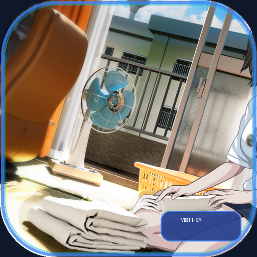

# 🌸 Dự Án Việt Hóa: HOME (RJ01556529)

<p align="center">
  
  <br>
  <b>Bản dịch Tiếng Việt hoàn chỉnh cho Visual Novel: HOME</b>
  <br>
  <i>Tương thích hoàn hảo trên Trình duyệt Web (PC, Mobile, Tablet) & Bản cài đặt cho Windows PC</i>
</p>

<p align="center">
  <a href="https://shimakazevn.github.io/Home-project/"></a>
  
  
  
</p>

---

## 🎮 1. Trải Nghiệm Trực Tuyến (Web Game)

👉 **Chơi ngay tại:** [https://shimakazevn.github.io/Home-project/](https://shimakazevn.github.io/Home-project/)

* **Không cần cài đặt:** Mở trình duyệt và chơi ngay lập tức trên máy tính, điện thoại Android, iPhone, iPad.
* **Tốc độ cao & Tiết kiệm dung lượng:** Hệ thống tự động nạp hình ảnh và âm thanh chất lượng cao qua Cloud CDN khi người chơi tương tác.
* **Chế độ Chơi Ngoại Tuyến (Offline Mode):** Hỗ trợ tải toàn bộ tài nguyên game về bộ nhớ thiết bị (IndexedDB) để chơi mượt mà khi không có kết nối mạng.
* **Tiện ích Điều khiển (Control Center):** Nút cài đặt thông minh tích hợp Lưu nhanh (Q.Save), Nạp nhanh (Q.Load), Xuất/Nhập tệp sao lưu `.sav`, Bật/Tắt Toàn màn hình, Tự đọc và Tua nhanh cốt truyện.

---

## 💻 2. Cài Đặt Patch Tiếng Việt Cho Windows PC

Nếu bạn đã có bản game gốc trên máy tính:

1. Tải toàn bộ thư mục dự án hoặc bản phát hành patch.
2. Chép toàn bộ thư mục `patch/` vào thư mục chứa game gốc của bạn.
3. Nhấp đúp vào tệp **`CAI_DAT_PATCH_VIET_HOA.bat`** để cài đặt tự động.
4. Mở file `HOME.exe` và thưởng thức bản dịch tiếng Việt hoàn chỉnh!

---

## ✨ 3. Tính Năng Nổi Bật Của Bản Dịch

* **Dịch thuật trọn vẹn 100%:** Toàn bộ cốt truyện chính, các nhánh phụ, hệ thống nhiệm vụ và giao diện trò chơi đều đã được chuyển ngữ trau chuốt, tự nhiên.
* **Bộ Font Chuẩn Tiếng Việt:** Sử dụng font *Noto Sans* hỗ trợ đầy đủ bộ gõ tiếng Việt có dấu, ngắt dòng thông minh không gãy từ.
* **Giao diện Cấu hình Tinh chỉnh:** Tối ưu hóa các bảng điều chỉnh âm lượng BGM, hiệu ứng âm thanh SE, giọng lồng tiếng của từng nhân vật và tốc độ hiển thị chữ.

---

## 📁 4. Cấu Trúc Thư Mục Dự Án

```
HOME-project/
├── index.html                  # Điểm khởi chạy Web Game
├── data/                       # Dữ liệu kịch bản & plugin Web
├── patch/                      # Bản vá tiếng Việt hoàn chỉnh
│   ├── data/scenario/          # Toàn bộ kịch bản (.ks) tiếng Việt
│   └── data/others/            # Font chữ, plugin tiện ích & CDN interceptor
├── tyrano/                     # TyranoScript HTML5 Visual Novel Engine
├── fonts/                      # Bộ font Noto Sans tiếng Việt chuẩn
├── translation/                # Cơ sở dữ liệu chuỗi dịch thuật
├── tools/                      # Các công cụ build & deploy tự động
│   ├── build_web_release.py    # Đóng gói và tối ưu Web Game
│   ├── deploy_gh_pages.py      # Tự động đẩy bản phát hành lên GitHub Pages
│   ├── build_vietnamese_game.py# Đóng gói bản cài đặt Windows PC
│   └── BUILD_GUIDE.md          # Tài liệu hướng dẫn xây dựng dự án
├── CAI_DAT_PATCH_VIET_HOA.bat  # Script cài đặt 1-click cho máy tính
└── README.md                   # Tài liệu giới thiệu dự án
```

---

## ⚖️ 5. Bản Quyền & Tuyên Bố Miễn Trừ (Disclaimer)

* Tác phẩm gốc thuộc quyền sở hữu của nhà phát triển **sorarevo** (Mã tác phẩm: `RJ01556529`).
* Dự án Việt hóa này được thực hiện phi thương mại nhằm mục đích giao lưu, trải nghiệm và học tập.
* Vui lòng ủng hộ tác giả gốc bằng cách mua game bản quyền nếu bạn yêu thích tác phẩm!
